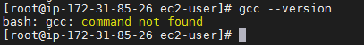
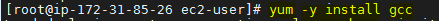
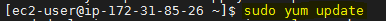
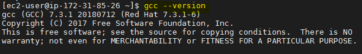
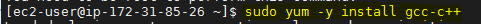
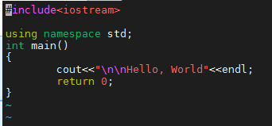
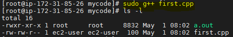
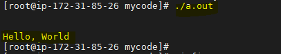

# How to run and setup the enviroment of CPP in AWS Cloud Instance for Linux amazon ubuntu OS?
First create the Amazon instance in your AWS Cloud, and log-in into it.

**Check setup is already install or not.**

*Try this command to check*

    gcc --version



if it shows like the above image then you have to setup the things.

## Step 1:- Installation of GCC-C++
Go and hit this command on your terminal. here we are installing the **GCC** with the *yum* package installer.

*command to Install*

    yum -y install gcc




*command to apply update*

    sudo yum update



**Check again setup is install or not.**

*Try this command to check*

    gcc --version



As might be seen from the output, the GCC version distributed by red hat 7 is 7.3.1-6 which is not the latest version of GCC.

You may also want to install gcc-c++. It will automatically include the C++ library and compile files with extensions that indicate they are C source as C++, instead of as C.

*Enter this command to Install GCC-C++*

    yum -y install gcc-c++



## Now we are all done and ready to implement our first ever CPP program on our AWS LINUX Instance.

# Step 2:- Implementation of CPP program.
Use any editor to type the code. I'am Using here vim editor to type the code of CPP.
```
#include<iostream>
using namespace std;
int main()
{
        cout<<"\n\nHello, World"<<endl;
        return 0;
}
```



# Step 3:- Compilation of CPP Program file.

*Use this command to Compile the CPP code and list the containt of current directory to see if the **.out** File is created or not.*

    sudo g++ first.cpp
    


# Step 4:- Running the Compile code of CPP

*Type this on terminal*

    ./a.out

After hiting this command you will get the output of the CPP Program.




**You are Done with running and setting-up the enviroment of CPP in AWS Cloud Instance for Linux amazon ubuntu OS**
