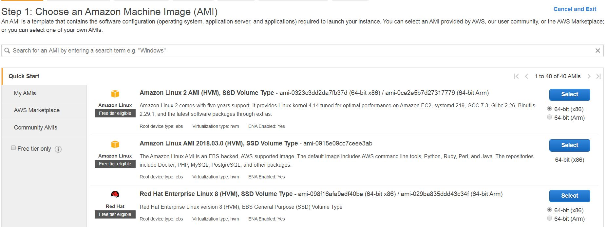
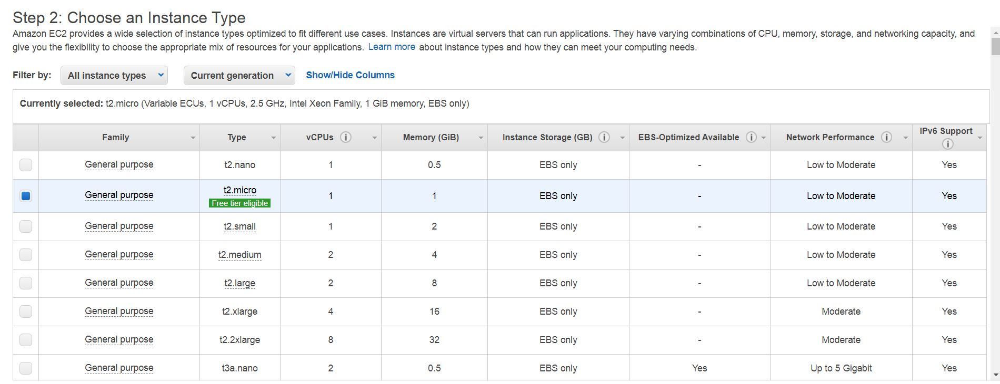
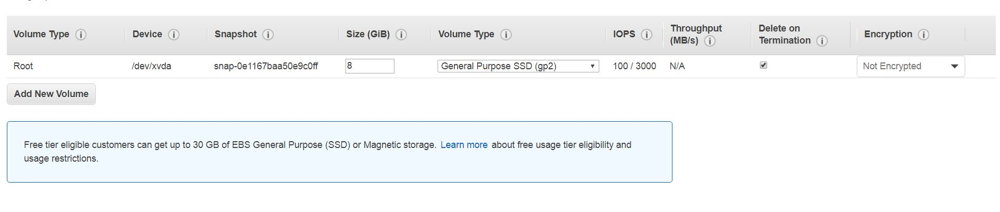

# EC2 {Elastic Compute Cloud}

[Amazon][Amazon] Elastic Compute Cloud (Amazon EC2) provides scalable computing capacity in the Amazon Web Services (AWS) cloud. Using Amazon EC2 eliminates your need to invest in hardware up front, so you can develop and deploy applications faster. You can use Amazon EC2 to launch as many or as few virtual servers as you need, configure security and networking, and manage storage. Amazon EC2 enables you to scale up or down to handle changes in requirements or spikes in popularity, reducing your need to forecast traffic.

[Amazon]: https://docs.aws.amazon.com/AWSEC2/latest/UserGuide/concepts.html

AWS provide us a service where we can create our own machine with the needed configuration,here we can scale up and scale down the recources and when ever we need and only pay for that much resources only. they charge us according to the usage (uptime).
## How To Setup The EC2 Instance in AWS ?

## step 1:- (Choose AMI)
```
Log-in into your AWS console and click on the "Services" drop-down, select/search "EC2 (Virtual Server In The Cloud)" click on it.
```



## step 2:- (Choose Instance Type)
```
According to required configuration select the Configuration type.

here, I'am selecting the t2.micro (1 CPU, 1 GB RAM).
```


## step 3:- (Configure Instance)
```
Leave This step as default. and go to "Next Step".
```

## step 4:- (Add Storage)
```
According to the requirement add the Volume (Storage) in this step.

here, I'am adding 30 GB Volume to my EC2 Instance.
```


## step 5:- (Add Tags)
```
Here in this Step we are going to add the tag (Name) to our EC2 Instance.

Click On "Add Tag" and specifi the name. Give "Key" as "Name" here "N" must be capital. and in value field type the desired name you want to give to you machine.
```


## step 6:- (Configure Security Group)
```
here, we connect to EC2 server through remote protocols such as SSH ,etc.. so, we can add rules to allow specific traffic to reach your instance.
```

1. **Check the radio button of "create a new security group>**

2. **Give the security grp name as you wish**

3. **Type description as you want**

4. **Click on "Review instance"**

## step 7:- (Review)
```
Here, we will get our instance ready.
```
### Start/Stop of instance.

1. **Check the check-box of instance and hit the "Action"  drop-down**
2. **Click on "instance state"**
3. **Do what you want to do eithr start/stop.**

Now we are all set with our First EC2 Instance now you can access it through any third party application like MobaXtream ,putty ,mremote etc.