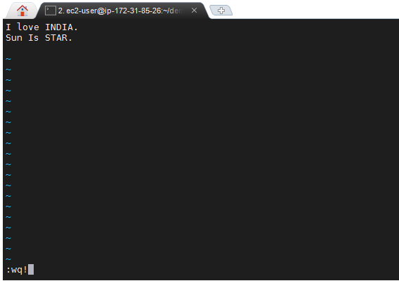

# Basic Command In Linux
## 1. SSH (Secure Shell for login)
SSh Command use to login in into our machine from remote location.
```
syntax:-
    ssh [options] <user-name>@<ip>
```


Here, I'am Using mobaxterm application to loged-in my AWS-EC2 instance.

## 2. ls (List Command)
*ls* command use to list the containt of the current directory.
```
syntax:-
    ls -[option]... [option]
```


## 3. cd (Change Directory)
cd *Change Directory* is use to switch from one directoy to another directory.
```
syntax:-
    cd <directory-name>
```


## 4. vi (editor command)

In Linux there is default editor known as *vi* editor it is used to create/edit the files.
```
syntax:-
    vi <file-name>
```


press "INSERT or I" key to insert/type the text into the file
to switch the mode back press *escape* key, the give the command to the editor accordingly.

1. **"W" for write (save) the entered text into file.** 

2. **"q" for quit (close) the file.**

3. **"!" for forcefully do the operation as mention before.**



to see the entered text in file type *vi* command with file-name.

## 5. cat (concatenate)
*cat* command use to print the content of file in terminal.
```
syntax:-
    cat <file-name>
```


## 6. touch 
*touch* command use to create the empty file with a current system time-stamp.
```
syntax:-
    touch <file-name>
```


## 7. pwd (print current working directory)
*pwd* command use to print the full current working directory path.


## 8. rm (Remove files or directories)
*rm* command is very powerful and dangerous command it is use to remove the files and folder permanently.
```
syntax:-
    rm -[option] <file-name>
```


## 9. MV (move files or directories)
*mv* command use to move the directory from one location to another.

It is also use to *rename* the file or folder.
```
syntax:-
    mv -[option] <source-files/folders> <destination-files/folders>
```


## 10. CP (Copy files or directory)
*cp* command use to copy the files or folder from one location to another location.
```
syntax:-
    cp -[option] <source-files/folders> <destination-files/folders>
```


## PATHS

    1. Absolute Path.
    2. Relative Path.
### 1. Absolute Path.
    An absolute path is specifying the location of a file or directory from the root directory(/).

    refere *mv* command.
### 2. Relative Path.
    Relative path is the path related to the present working directly(pwd).

    refer the *cp* command.
