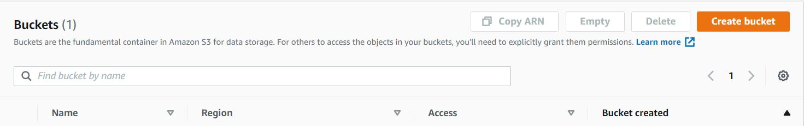
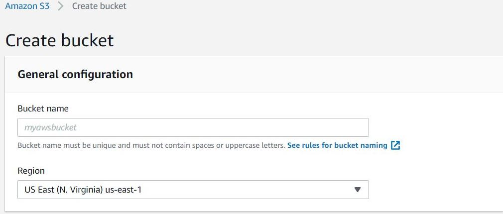

# What is Firewall ?
A firewall is a network security system that monitors and controls incoming and outgoing network traffic.
based on predetermined security rule.

It is kind of filter to incomming and outgoing request.

# What is security group ?
Security Group in cloud is a set of IP filter rules that define how to handle incoming and outgoing traffic to both the public and private interfaces of a virtual instance in cloud.

The rules that you add to a security group are known as security group rules.

##  Security groups in Firewall.

### 1. Inbound Rule
An inbound firewall protects your network from threats that originate from outside your network and attempt to infiltrate your network inwardly.

Inbound refers to connections coming-in to a specific device from a remote location.
### 2. Outbound Rule
An outbound firewall protects against nefarious traffic that originates internally and travels outwardly.

Outbound refers to connections going-out to a specific device from a device/host

# What is S3 bucket in AWS?
Amazon **Simple Storage Service (S3)** is a high-speed, web-based cloud storage service designed for online backup and 
archiving of data and applications on Amazon Web Services. Amazon S3 was designed with a minimal feature set and created to make 
web-scale computing easier for developers.

It is like a Google cloud, but more than that.

# Steps To Create Our First S3 Bucket

## Step 1:- 
```
Sign-in to the AWS Console.

```

## Step 2:-
```
From "Service" Drop-down select or Search "S3 bucket" and click on "Create Bucket".
```



## Step 3:-
```
On Name and Region page type bucket name and keep in mind that  it must be unique across all existing buckets in Amazon AWS.
```


## Step 4:-
```
Now, you able to see the bucket you have just created, click on it
```


## Step 5:-
```
Now you are all set to upload a file/folder click on "upload" button and fetch your file/folder you want to insert.
```

```
After Upload 
```


```
click on the "Add files" button and brows the files you want to upload and click on "Upload" (at left down corner of the windows)
```
## Step 6:-
```
On successfullly uploading the files/folder if you want to host/access the files just click on check-box infront of the file and click on action drop-down and select "Make Public". copy the URL ans share URL to access the Files/Folder.

1. On "Properties" tab, we configure properties for bucket.

2. On "permissions" tab, we can give access according to the role
added (private, owner, public).

3. On "Review" tab, we use to modify our settings.
```

# What is RDS in Cloud ?
**RDS** stand for **Relational Database Service**
Amazon **Relational Database Service** is a *distributed relational database service* by Amazon Web Services (AWS). 
It is a web service running "in the cloud" designed to simplify the setup, operation, and scaling of a relational database 
for use in applications.
