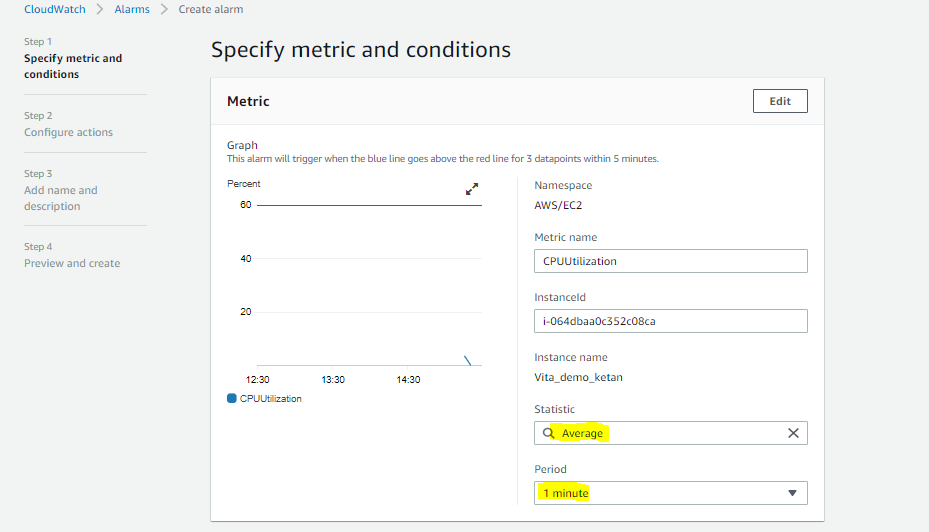

# How To Configure The CPU Utilization Alarm For AWS Instance ?

# Step 1:-

Log in into your **AWS console** copy you **Instance ID** and go to the **CloudWatch Alarm Dashboard** tab.


**Click On Create alarm**.


**Click** on the **Select Matric.**

you will find the **EC2** tab click on it and **search you copied Instance ID** in the give search window, through this you will find only your specfice Instance with Filter as ID.

As, we are creating the alarm on **CPUUtilization Matric** see the Matric Name cloumn with *"CPUUtilization"* and check the checkbox in front of it.


Click On **Select Matric**

### Specify Matric And Condition.

Here in this step we are going to add the threshold value for our alarm to trigger.

let's put *Period* as *1 Minute* with *Statistic* as *Average* and 60% as my threshold value with number of dotpoints within the evauation period that must be breaching to cause the alarm to go to alarm state.




# Step 2:-

## Configuration Action.

In this step we are going to set SNS (Simple Notification Service) topic, Auto scaling in any and EC2 action.

### Notification

In this section we are setting our SNS (Simple Notification Service) topic, where we add and verify the email in SNS  through which we are getting notify.


Here, we select our old SNS topic, we can also create the new one from here also.

so select the best option according to your choice. 

### Auto Scaling Option

Here we can scale our instance by defining the scaling group and set the action according to that.

for now we are leaving it as it is as this is our demo to set alarm.


### EC2 action

Here we can define the action according to our need as *Stop/Terminate/Reboot this instance*


For now leave this one also as it is ad click on **Next**.

# Step 3:-

## Add Name And Description

Give name and Description to the alarm.


# Step 4:-

## Preview and create 

Preview the instacne once and validate it if all parameters are correct go and hit the **create alarm.**


Our alarm get created successfully and ready to use now as you see from the below image.


Now login to the EC2 instance by putty, mobaxterm, etc. iam using mobaxterm. and create *SSH* session use two tab so that we can observe the few things better.

Now we are going to race our CPU to 100% using command and see if the alarm get trigger and AWS send us a mail or not.

after login to EC2 instance via *ssh* see the instance configuration by just *cat the file cpuinfo*

```
cat /proc/cpuinfo
```


Notice the "Processor" line for every information section. It has a value starting from 0 and ending at the number of cores/threads.

here in our case we are going to hit it for one time only.

in one tab go and hit the *top* command and see the CPU usage.


this is when our CPU is in ideal state or no process is running. now we are going to race our CPU with the below command.

switch to super user

```
sudo su
```

the race cpu with this.

```
# yes > /dev/null/ &
```

this command will give us a PID because of *&* at the last of  command note it down as we need this to take CPU back to normal state. 


as we can see our CPU geeting race byt the command we can see this in the *top* command output.


Now Observe the **CPUUtilization Matric in CloudWatch Matric** in the *cloud watch* dashboard we will see the spike in few moment.


and we also get the *mail* from AWS end for our EC2 CPUUtilization.


Now lets get *back* our CPU *to Normal state*.

hit this command in terminal.

```
    1. ps -ef | grep yes

    2. kill -9 <PID> 
```


As we can see the cpu is getting back to normal state, and spike getting travel to below threshold line (Red line).


With this we configure our *SNS (Simple Notification Service)* topic on the EC2 instance and set the alarm and test on the **CPU Utilization Matric**
